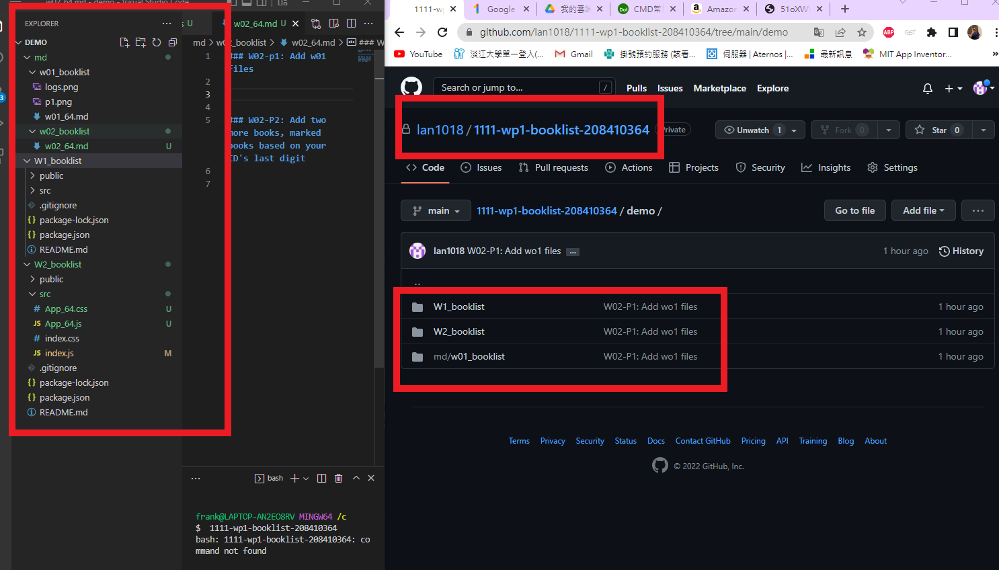
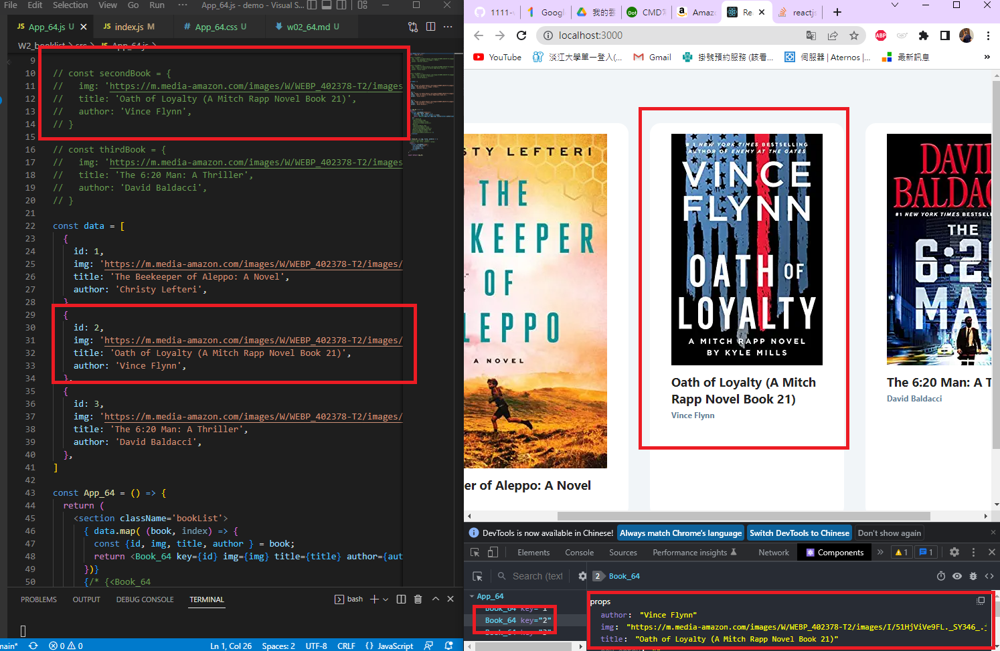
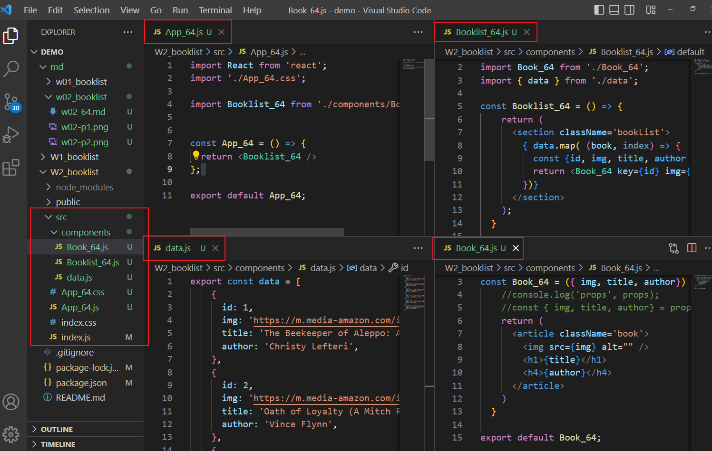
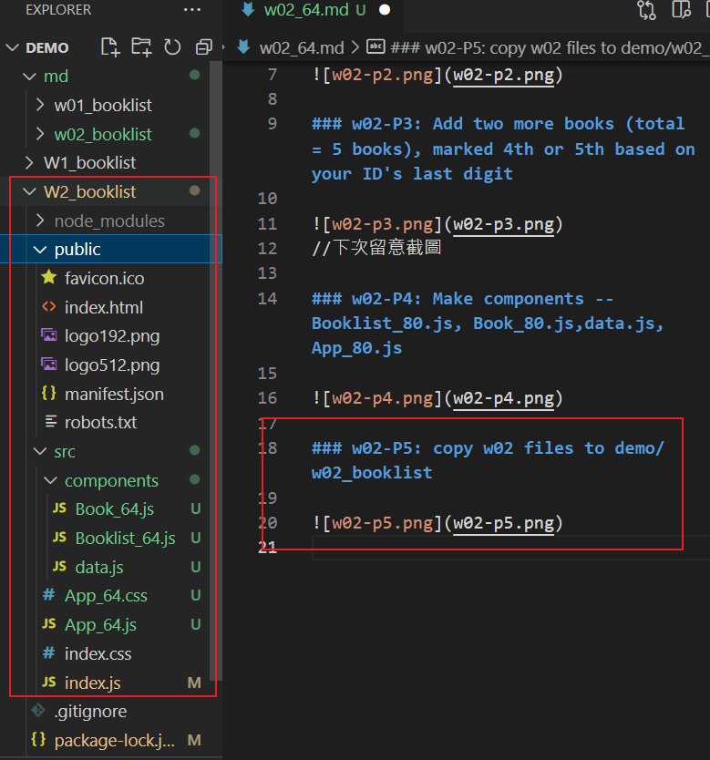

### W02-p1: Add w01 files

### W02-P2: Add two more books, marked books based on your ID's last digit

### w02-P3: Add two more books (total = 5 books), marked 4th or 5th based on your ID's last digit

//下次留意截圖

### w02-P4: Make components -- Booklist_80.js, Book_80.js,data.js,App_80.js

### w02-P5: copy w02 files to demo/w02_booklist

### w02-P6: All logs

